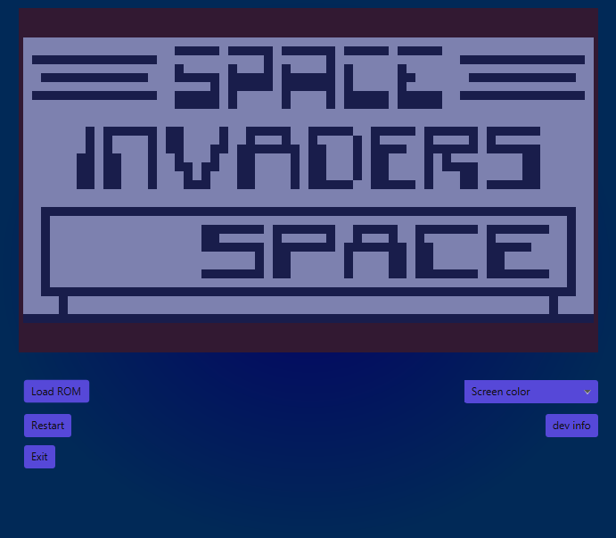

# JCHIP8 Emulator

A **CHIP-8** emulator written in Java by [8touzin](https://github.com/8touzin).



---

##  Features

- Clean and styled JavaFX interface
- Load classic CHIP-8 ROMs
- Graphics display, keyboard input, sound, and timers
- Modular Java application (Java modules)
- Standalone executable JAR build

---

##  Prerequisites

- **Java 21** (JDK or JRE)  
   [Download from Adoptium](https://adoptium.net)

- **JavaFX SDK 21**  
   [Download here](https://gluonhq.com/products/javafx/)

---


##  How to run the emulator

###  Windows

Double-click `run.bat`  
Or run manually:

```bat
java --module-path "javafx-sdk-21.0.7\lib" --add-modules javafx.controls,javafx.fxml -jar jchip8-fat-1.0.jar
```
---

##  Loading a ROM

1. Place your `.ch8` files in the `roms/` folder
2. The emulator can load a default ROM or open a file chooser to select a ROM

---

##  Dependencies

- JavaFX 21.0.7
- Gradle plugins:
  - `org.beryx.jlink` *(optional for native build)*
  - `org.openjfx.javafxplugin`
- Lombok *(compile-time only)*

---

##  Build (for developers)

```bash
./gradlew clean jar
```

The final JAR will be in `build/libs/jchip8-fat-1.0.jar`  
Run with JavaFX using `--module-path`.

---

## Author

👤 **8touzin**  
GitHub: [github.com/8touzin](https://github.com/8touzin)

---

## License

© 2025 8touzin. All rights reserved.  
This project is private and not licensed for reuse, copying, or modification.
